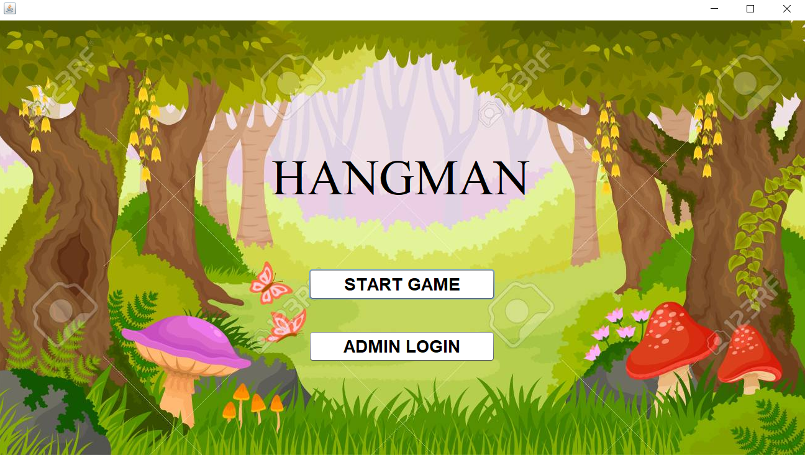
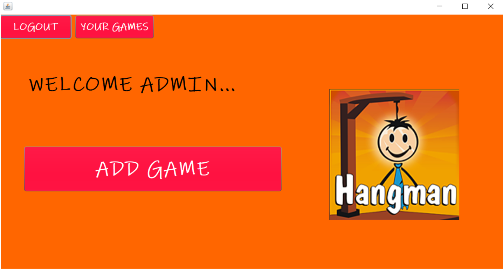
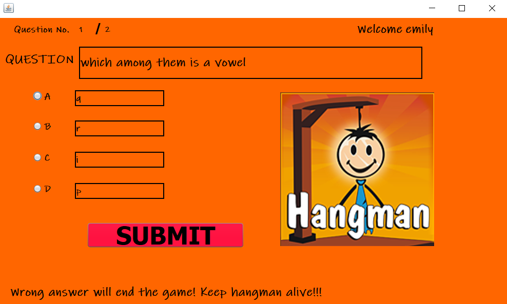
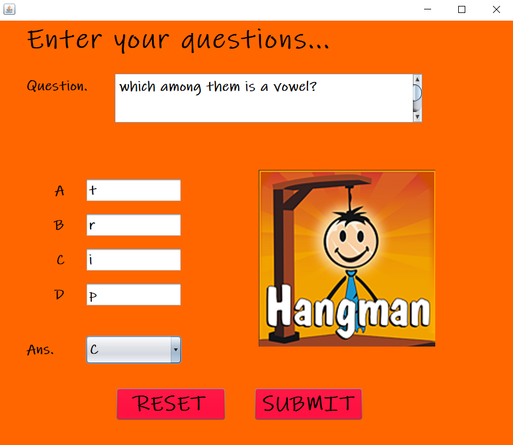
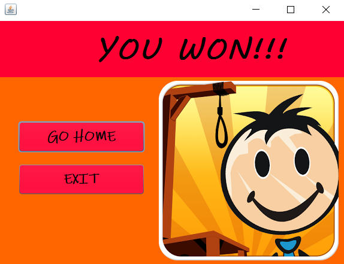
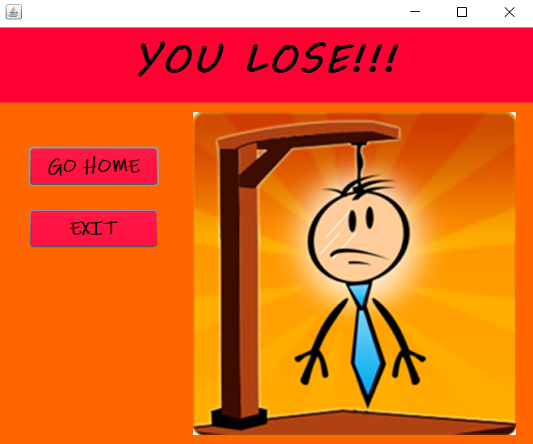

# Hangman
Hangman game is developed using core java, SQL and is fully controlled by the administrator. The administrator can login into his/her account, make quizzes like games, delete games, modify games. The players can attempt the game prepared by the administrator only.

Language Used - Java Core

Concept Used - Swing

Database Used - MySQL

IDE Used - Netbeans

![]projectscreenshots/(q2.PNG)

